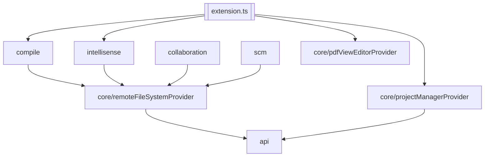

# Extension Anatomy

We will firstly take a glance at the project root directory in the separate views of files and directories, and then dive into the details of the folders of source code.

## Project Root Directory

**Files at the Root Directory**

```
├── CHANGELOG.md
├── CODE_OF_CONDUCT.md
├── CONTRIBUTING.md
├── LICENSE
├── README.md
├── commitlint.config.js
├── package-lock.json
├── package.json
├── package.nls.json
├── tsconfig.json
```

- `CHANGELOG.md`, `CODE_OF_CONDUCT.md`, `CONTRIBUTING.md`, `LICENSE`, `README.md` are the standard files for open source projects.
- `commitlint.config.js` is the configuration file for [commitlint](https://commitlint.js.org/#/).
- `package.json` is the configuration file for [npm](https://docs.npmjs.com/cli/v7/configuring-npm/package-json), which contains the metadata of the extension. `package-lock.json` is the lock file for `package.json`.
- `package.nls.*json` is the configuration file for [vscode-nls](https://github.com/microsoft/vscode-nls), which contains the metadata of the localization of the `package.json`.
- `tsconfig.json` is the configuration file for [TypeScript](https://www.typescriptlang.org/docs/handbook/tsconfig-json.html), which specifies the root files and compiler options required to compile the project.

**Directories at the Root Directory**
```
├── .github
├── .husky
├── .vscode
├── data
├── docs
├── l10n
├── patches
├── resources
├── src
└── views
```

- `.github`, `.husky`, `.vscode` are the configuration directories for [GitHub Actions](https://docs.github.com/en/actions), [husky](https://typicode.github.io/husky/#/), and [VS Code](https://code.visualstudio.com/docs/editor/tasks-appendix), respectively.
- `data` contains the static data extracted from [overleaf frontend](https://github.com/overleaf/overleaf/tree/main/services/web/frontend/js/features/source-editor/languages).
- `docs` contains the documentation of the extension.
- `l10n` contains the localization files of the extension used by [vscode-nls](https://github.com/microsoft/vscode-nls), which functions together with `package.nls.*json`.
- `patches` contains the patches for the node modules, which are applied by [patch-package](https://www.npmjs.com/package/patch-package) in the `postinstall` script of `package.json`.
- `resources` contains the media resources of the extension, including the icons and the images.

## `src`: Extension Source Code

There are two files at the root directory of `src`:
- `src/extension.ts` is the entry point of the extension, which is invoked when the extension is activated.
- `src/consts.ts` contains the constants used in the extension.

The **Dependency Graph** of the following modules is illustrated as follows:


### `src/api`
The definition of the overleaf server public API.

#### `src/api/base.ts`
The implementation of web RESTful API used by overleaf server.
The implementation is carried out with the help of [overleaf web router list](webapi.md) and the browser developer tools, and is loosely coupled with the extension for reuse in other projects.

**Interfaces**

All the interfaces defined with `Schema` define the response schema from the server.

The interface `Identity` define the format of login information persisted in [vscode globalState](#utilsglobalstatemanagerts), only website cookies and webpage CSRF token are stored.

**Class**

The `class BaseAPI` is the the only export class in this file, whose function can be split into following categories:
- **utility functions**: `setIdentity` which alter the global identity when necessary, `request` to apply http request with proper credentials, `download` to download large files possible with `206 Partial Content` status code
- **login-related API**: `(private async) getCsrfToken`, `(private async) getUserId`, `(async) passportLogin`, `(async) cookiesLogin`, `(async) updateCookies`, `(async) logout`
- **project management API**: `(async) userProjectsJson / getProjectsJson`, `(async) newProject`, `(async) renameProject`, `(async) deleteProject`, `(async) archiveProject`, `(async) unarchiveProject`, `(async) trashProject`, `(async) untrashProject`, `(async) getAllTags`, `(async) createTag`, `(async) renameTag`, `(async) deleteTag`, `(async) addProjectToTag`, `(async) removeProjectFromTag`
- **project editing API**: `(async) getFile`, `(async) addDoc`, `(async) uploadFile`, `(async) uploadProject`, `(async) addFolder`, `(async) deleteEntity`, `(async) deleteAuxFiles`, `(async) renameEntity`, `(async) moveEntity`, `(async) getFileFromClsi`, 
- **compile-related API**: `(async) compile`, `(async) indexAll`, `(async) proxySyncPdf`, `(async) proxySyncCode`
- **project history API**: `(async) proxyToHistoryApiAndGetUpdates`, `(async) proxyToHistoryApiAndGetFileDiff`, `(async) proxyToHistoryApiAndGetFileTreeDiff`, `(async) downloadZipOfVersion`, `(async) getLabels`, `(async) createLabel`, `(async) deleteLabel`
- **intellisense API**: `(async) getMetadata`, `(async) proxyRequestToSpellingApi`, `(async) spellingControllerLearn`, `(async) spellingControllerUnlearn`
- **chat message API**: `(async) getMessages`, `(async) sendMessage`
- **project settings API**: `(async) getProjectSettings`, `(async) updateProjectSettings`

#### `src/api/socketio.ts`
The implementation of `socket.io-client`-based websocket API used by overleaf server.
The implementation is carried out by observation of raw websocket messages via browser developer tools, and is loosely coupled with the extension for reuse in other projects.

There are currently two versions of `socketio` API is supported:`v1` for relative old versions, `v2` for `overleaf.com` (maybe a newer version, mentioned in [this issue](https://github.com/iamhyc/Overleaf-Workshop/issues/42)).
The only difference exists in the handshake phase: whether the `projectId` parameter should be passed.

**Interfaces**

The exported interfaces `UpdateUserSchema`, `OnlineUserSchema`, `UpdateSchema` define the response schemas from the server.

The exported interface `EventsHandler` defines various events which aggregated various events sent from server as shown in `this.updateEventHandlers`, and enable the functions of [virtual filesystem](#srccoreremotefilesystemproviderts)

**Class**

The `class SocketIOAPI` is the only export class in this file, which uses a standalone `init` function as its constructor for the purpose of external usage to reset the connection.

Specifically, the purposes of the major methods are listed below:
- **public methods**
  - send events to server and get response: `(async) joinProject`, `(async) joinDoc`, `(async) leaveDoc`, `(async) applyOtUpdate`, `(async) getConnectedUsers`, `(async) updatePosition`
  - [alternative socketio](#srcapisocketioaltts) proxy: `(get) unSyncFileChanges`, `(async) syncFileChanges`
  - `updateEventHandlers`: mapping from the `socketio` event names to the aggregated events defined in `interface EventsHandler`


#### `src/api/socketioAlt.ts`
As the name suggests, this file provides an alternative implementation of the `socketio` API used by overleaf server, via http requests instead of websocket.

**Types**

The two types `type EmitEventsSupport` and `type ListenEventsSupport` define the events that the client would emit to server and listen from server, respectively.
Considering the restrictions of the public API (some API used by `socketio` is marked as *private* and not exposed), there are some shortcomings of the alternative implementation:
- Due to the nature of http requests, the client would periodically poll the server for the events (e.g., 3 seconds), instead of listening to the events in real time.
- The new folder created by other collaborators would not be shown in the file tree, and so does the new files created inside the new folder.
- The cursor position of other collaborators would not be shown in the editor, and so does the local client's cursor position.
- The editing changes would be applied to remote server via *force overwrite* instead of *diff & patch*, and your collaborators would suffer from the "external update" and have to refresh the webpage, unless they are using this vscode extension

**Class**

The `class SocketIOAlt` is the only export class in this file, whose implementation is tightly coupled with the [virtual filesystem](#srccoreremotefilesystemproviderts), and hence highly depends on the `vscode` API.
The `class SocketIOAlt` extends the interface of native `socket.io-client`: `emit`, `on` and `disconnect`, and also fulfil the interface of `class SocketIOAPI` for alternative implementation.

Specifically, the purposes of the major methods are listed below:
- **public methods**
  - `(constructor)`: init the Timeout tasks to periodically apply the http requests and emit events for extension usage.
  - `emit`, `on`, `disconnect`: emit the events in `type EmitEventsSupport`, listen to the events in `type ListenEventsSupport`, and imitate the socket disconnection, respectively.
  - `(get) unSyncedChanges`: return the number of un-synced changes.
  - `(async) uploadToVFS`: upload the changes to the overleaf server using `uploadFile` API, and emit `reciveNewDoc` for extension usage.
- **private methods**
  - `(get) randomEntityId`, `(get) vfs`: utility functions, provide pseudo entity ID and asynchronous vfs access, respectively.
  - `(async) refreshVFS`, `(async) refreshMessages`: the Timeout tasks, periodically fetch project history and message list, respectively.
  - `watchConfigurations`: watch the vscode configuration changes on refresh intervals, and reset the task interval when necessary.

### `src/collaboration`
The standalone module for online users and chat message functions.

#### `src/collaboration/clientManager.ts`
The export `class ClientManager` exposes features to vscode via `(get) triggers` with:
> Notice that it ties to `this.socket.updateEventHandlers` in its constructor, which may cause memory leak even when all triggers are disposed ([related issue #51](https://github.com/iamhyc/Overleaf-Workshop/issues/51))
- **StatusBarItem**
  - **Tooltip**: hover the item displays the client connection status, online user status (inactive time, cursor position) periodically (500ms) refreshed in `this.updateStatus` function.
  - **Settings**: click the item to display project-dependent settings defined in `this.collaborationSettings`
- **Commands**:
  - "${ROOT_NAME}.collaboration.insertText`": insert text to the [chat webview](#srccollaborationchatviewproviderts)
  - "${ROOT_NAME}.collaboration.jumpToUser"
  - "${ROOT_NAME}.collaboration.revealChatView"

#### `src/collaboration/chatViewProvider.ts`
The export `class ChatViewProvider` exposes features to vscode via `(get) triggers` with:
- **WebviewProvider**: the chat webview in the sidebar, whose source code is located in [views/chat-view](#viewschat-view)
- **Commands**:
  - "${ROOT_NAME}.collaboration.copyLineRef": context menu to document editor to copy the line reference to clipboard
  - "${ROOT_NAME}.collaboration.insertLineRef": context menu to document editor to insert the line reference to the chat webview

### `src/compile`
The standalone module for compiling and error diagnostics functions.

#### `src/compile/compileManager.ts`
The export `class CompileManager` exposes features to vscode via `(get) triggers` with:
- **DiagnosticCollection**: display compile errors/warnings on documents provided by `class CompileDiagnosticProvider`
- **StatusBarItem**
  - **Tooltip**: hover to display the detailed compile status
  - **Settings**: click the change the compile in `(async) compileSettings`
- **Commands**:
  - "${ROOT_NAME}.compileManager.compile": request compile on the server
  - "${ROOT_NAME}.compileManager.viewPdf": open [pdf viewer](#srccorepdfvieweditorproviderts)
  - "${ROOT_NAME}.compileManager.syncCode": synctex
  - "${ROOT_NAME}.compileManager.syncPdf": reverse synctex

#### `src/compile/compileLogParse.ts`
> Contributed by [@Li-baster](https://github.com/QianrenLi)

This file functions as the compile log parser severing for `class CompileDiagnosticProvider` in [compile manager](#srccompilecompilemanagerts).

### `src/core`
The standalone module which consists of the most important components of this extension.

#### `src/core/pdfViewEditorProvider.ts`
The export `class PdfViewEditorProvider` exposes features to vscode via `(get) triggers` with:
- **CustomEditorProvider**: PDF viewer powered by `pdf.js`, whose source code is located in [views/pdf-viewer](#viewspdf-viewer).

#### `src/core/projectManagerProvider.ts`
The export `class ProjectManagerProvider` exposes features to vscode via `(get) triggers` with:
- **TreeDataProvider**: provides for project tree view.
- **Commands**: commands used in projects tree view.

#### `src/core/remoteFileSystemProvider.ts`
The export `class RemoteFileSystemProvider` exposes features to vscode via `(get) triggers` with:
- **FileSystemProvider**: via `class RemoteFileSystemProvider`, the most important components of this extension.
- **Commands**:
  - "remoteFileSystem.prefetch": the command to access or warm-up the virtual filesystem anywhere in this extension.

### `src/intellisense`
The standalone module for auto-completion, document formatting and symbol provider functions.

#### `src/intellisense/langIntellisenseProvider.ts`
The `(abstract) class IntellisenseProvider` define the basic behavior of various completion provider in this file and a basic context range regex via `(protected get) contextRegex`.

The export `class LangIntellisenseProvider` exposes features to vscode via `(get) triggers` with:
- **CompletionItemProvider** via `class ReferenceCompletionProvider`, `class FilePathCompletionProvider`, `class ConstantCompletionProvider`, `class CommandCompletionProvider`
- **DocumentLinkProvider** via `class FilePathCompletionProvider`
- **CodeActionsProvider** via `class MisspellingCheckProvider`
- **DiagnosticCollection** via `class MisspellingCheckProvider`
- **StatusBarItem**
  - **Tooltip**: hover to display the current spell check.
  - **Settings**: click to config the spell check.

It also proxy the trigger exposes for [texDocFormatter](#srcintellisensetexdocformatterts) and [texDocSymbolProvider](#srcintellisensetexdocsymbolproviderts).

#### `src/intellisense/texDocFormatter.ts`
> Contributed by [@Li-baster](https://github.com/QianrenLi)

The export `class TexDocFormatter` exposes features to vscode via `(get) triggers` with:
- **DocumentFormattingEditProvider**
- **DocumentRangeFormattingEditProvider**

#### `src/intellisense/texDocSymbolProvider.ts`
> Contributed by [@Li-baster](https://github.com/QianrenLi)

The export `class DocSymbolProvider` exposes features to vscode via `(get) triggers` with:
- **DocumentSymbolProvider**

### `src/scm`
The standalone module for history view and source control management functions.

#### `src/scm/index.ts`
The source control manager (SCM) targets to provide alternative version management in sync with overleaf server version system.
This file provides the abstract interface for SCM implementations, e.g., [local replica](#srcscmlocalreplicascmts) and [local git bridge](#srcscmlocalgitbridgescmts).

#### `src/scm/scmCollectionProvider.ts`
The export `class SCMCollectionProvider` exposes features to vscode via `(get) triggers` with:
- **StatusBarItem**
  - **Tooltip**: hover to display SCM sync status
  - **Settings**: click to configure SCM
- **Commands**:
  - "${ROOT_NAME}.projectSCM.configSCM": configure SCM
  - "${ROOT_NAME}.projectSCM.newSCM": create new SCM

#### `src/scm/historyViewProvider.ts`
The export `class SCMCollectionProvider` exposes features to vscode via `(get) triggers` with:
- **TreeDataProvider** via `class HistoryDataProvider`
- **TextDocumentContentProvider** via `class HistoryDataProvider`
- **Commands**
  - "${ROOT_NAME}.projectHistory.clearSelection": clears the file selection in history view on sidebar
  - "${ROOT_NAME}.projectHistory.revealHistoryView": focus on the history view

It also proxies commands for `class HistoryDataProvider` via `(get) triggers`.

#### `src/scm/localReplicaSCM.ts`
The exported `LocalReplicaSCMProvider` implements the `BaseSCM` interface and supports the ["Open Project Locally"](wiki.md#open-project-locally) feature.

Since the local filesystem keeps no version information, at the start of project open, it always apply `this.overwrite` to overwrite local changes with overleaf server version.
Therefore, if there is a network disturbance, your local changes or remote changes (by other collaborators) will be lost depending on `syncFromVFS` is called via `this.vfsWatcher` firstly, or `syncToVFS` is called via `this.localWatcher` firstly.

A smarter solution is proposed in `(private async) overwrite`, but is not applied in the `this.writeFile`.

#### `src/scm/localGitBridgeSCM.ts`
> Not completed now. Target to provide local git bridge via [isomorphic-git](https://github.com/isomorphic-git/isomorphic-git) without local file system or git client binary needed.

### `utils`
The utility functions for global usage

#### `utils/eventBus.ts`
The export `class EventBus` provides type regulations for global event emit and handling.

#### `utils/globalStateManager.ts`

**Interfaces**

The interface `ServerPersist` and `ProjectSCMPersist` define the format of overleaf server persist information with related [SCM](#srcscm) configuration in vscode `globalState`.

The export `class GlobalStateManager` provides a wrapper to access `globalState` with `vscode.ExtensionContext`, and proxy some functions like `authenticate` for the easy access in [virtual filesystem](#srccoreremotefilesystemproviderts) with only server name.

## `views`: Webview Source Code

### `views/chat-view`
A standalone vue project which provides chat webview and use `@vscode/webview-ui-toolkit` to communicate with [src/collaboration/chatViewProvider](#srccollaborationchatviewproviderts).

### `views/pdf-viewer`
A patched `pdf.js` release which holds the original release in the `views/pdf-viewer/vendor` folder, and apply `pdfjs*.patch` to it.
The `index.js` and `index.css` files are the entry of the webview provided to [src/core/pdfViewEditorProvider](#srccorepdfvieweditorproviderts).

## Workflows

### `package.json`

**scripts**
> Common usage: `npm install` -> `npm run compile` -> `vsce package` / `vsce publish`

- **"download-pdfjs"**, **"download-latex-basics"**: invoked by `postinstall` to download the release of [`pdf.js`](https://github.com/mozilla/pdf.js/releases) and [`vscode-latex-basics`](https://github.com/jlelong/vscode-latex-basics) from Github.
- **"postinstall"**: invoked after `npm install` to patch the node modules and download the extra vendor packages.
- **"prepare"**: invoked after `npm install` to configure `husky` and `commitlint`.
- **"vscode:prepublish"**: invoked before `vsce package` or `vsce publish` to compile the extension.

- **"compile"**: invokes `tsc` to compile the extension in the `out` directory defined by `outDir` in `tsconfig.json`.
- **"watch"**: invokes `tsc` to watch the changes of the extension, invoked by vscode when the extension is opened in the development mode.
- **"lint"**: invokes `eslint` to lint the extension.

**other fields**
- **"activationEvents"**: defines when the extension `activate` function is called ([ref](https://code.visualstudio.com/api/references/activation-events)).
- **"main"**: defines the actual entry point of the extension.
- **"l10n"**: defines the localization files of the extension used by [vscode-nls](https://github.com/microsoft/vscode-nls).
- **"contributes"**: defines the functionalities of the extension.
- **"extensionKind"**: defines the execution preference of the extension ([ref](https://code.visualstudio.com/api/advanced-topics/remote-extensions)). 

### `.github/workflows`
- `lock-threads.yml`: [lock-threads](https://github.com/dessant/lock-threads) is used to lock inactive closed issues and pull requests.

### `.husky`
- `commit-msg` hook: [commitlint](https://commitlint.js.org/#/) is used to check the commit message.
