# Overleaf Workshop Wiki

Overleaf Workshop is an open-source extension for Overleaf users to manage projects, edit documents, and collaborate in Visual Studio Code.
The name of the extension is inspired by the well-known [LaTeX Workshop Extension](https://github.com/James-Yu/LaTeX-Workshop).

The aim of Overleaf Workshop is to provide a seamless experience for Overleaf users to enjoy the service of Overleaf in VS Code just like in the web browser, while benefiting from the powerful features and extensions of VS Code.


## Servers Management
Besides the official Overleaf server provided on [https://www.overleaf.com](https://www.overleaf.com), we also support the access to self-hosted [Overleaf Community Edition](https://github.com/overleaf/overleaf/wiki) and [Overleaf Server Pro Edition](https://www.overleaf.com/for/enterprises) servers.

> [!WARNING]
> Notice that the official server (with premium features) and Server Pro Edition are neither free nor open-source, the feature support for these servers is limited.
> All these extra features are marked with `Pro` in the following sections.

### Add New Server

Navigate to the extension page on the Activity Bar, you can see a default server `www.overleaf.com` in the hosts list with a fresh installation of the extension. It is unremovable until you add a new server.

To add a new server, click the `Add New Server` button on the top of the hosts list title as below.

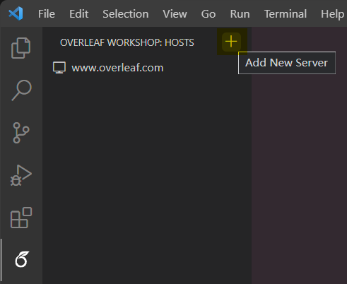

Then a input box will pop up, enter the server URL and press `Enter` to confirm to add the server.

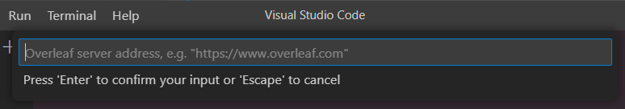

 The server URL should be exact the same as the home page URL of the server. Here are some notes:
- The URL should always start with `https://` or `http://`.
- The `www` subdomain is non-negligible, e.g., `https://overleaf.com` is not valid.
- The unnecessary path of the URL should be removed, e.g., `https://www.overleaf.com/project` should be `https://www.overleaf.com`.

### Remove Server

To remove a server, right click the server in the hosts list and select `Remove Server` in the context menu. There will be a confirmation dialog to confirm the removal.

Notice that if you have logged in to the server, the login information will be removed as well, which is not a logout action. That is to say, if you previously use cookies to login to the server, the cookies in the browser is still valid. If you want to also logout from the server while removing it, please remember to [logout from server](#logout-from-server) firstly before removing it.

### Login to Server

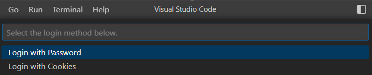

There are currently two ways to login to the server: login with email and password, and login with cookies.

> [!WARNING]
> According to the [open-source `passportLogin` design](https://github.com/overleaf/overleaf/blob/5fc2535842b2727cb1ec33ed5543ca614b4fc25b/services/web/app/src/Features/Authentication/AuthenticationController.js#L79) and observation of the login process, the email and password are sent to the server in ***plain text***, which implies that the server can ***see your password*** even if the connection is encrypted.
> We highly suggest you aware of this risk and use a ***separate password*** for the server, or use [SSO login](https://www.overleaf.com/learn/how-to/Managing_your_Overleaf_emails_and_login_options#Logging_in_with_institutional_or_organizational_single_sign-on_(SSO)) instead.

> [!NOTE]
> We are working on the webview-based login feature (to be appeared in `v1.0.0`). Please stay tuned.

#### Login with Email and Password
If you can login via email and password on the web browser, you can also login via email and password in VS Code. The exception is that Captcha is enabled on the server, then you have to [login with cookies](#login-with-cookies) instead.

#### Login with Cookies
As for the cases that Captcha is enabled on the server, or you want to login with SSO, you have to login with cookies from an already logged-in browser. The steps are as follows:

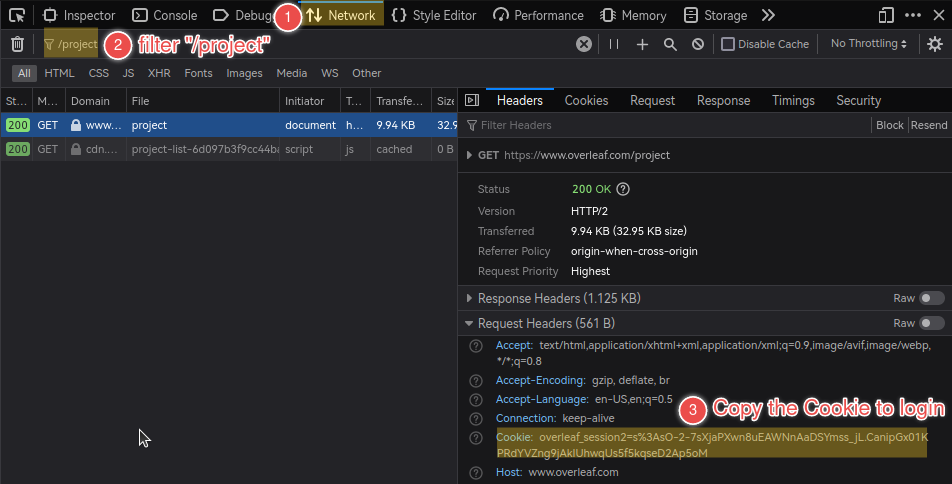

1. Open "Developer Tools" (usually by pressing <kbd>F12</kbd>) and switch to the "Network" tab;

   Then, navigate to the Overleaf project page (e.g., `https://www.overleaf.com/project`) in the address bar.

2. Filter the listed items with `/project` and select the exact match.

3. Check the "Cookie" under "Request Headers" of the selected item and copy its value to login.
    > The format of the Cookie value would be like: `overleaf_session2=...` or `sharelatex.sid=...`

### Logout from Server

To logout from a server, hover on the logged-in server in the hosts list, then click the `Logout Server` button on the rightmost of the server name. There will be a confirmation dialog to confirm the logout. This action will remove the login information from the extension, and also invalidate the related cookies as a normal logout process.

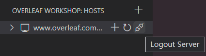

### Refresh Project List

After login to a server, the project list will be automatically loaded, together with your email address displayed aside. If there is any external change (not via the extension) to the project list, you can hover on the server, then click the `Refresh Project List` button to refresh the whole project list.

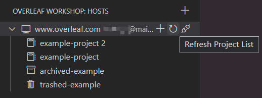

## Projects Management

### Create New Project

Hover on the server, then click the `New Project` button to create a new project.
There are currently three ways to create a new project: **Blank Project**, **Example Project**, and **Upload Project** (via local archive).

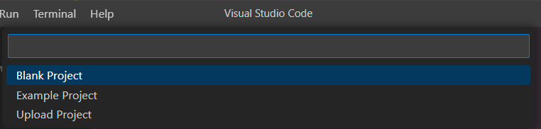

### Archive / Trash / Delete Project

As shown in the screenshot in the previous section, the normal / archived / trashed projects are displayed with different icons. You can right click on a project to (un)archive or (un)trash it.
Only trashed projects can be deleted, which means the project will be permanently removed from the server.

For explicit transition rules, please refer to the following graph:
> The solid lines indicate the action is available in the context menu, while the dashed lines indicate the action is available when hovered.
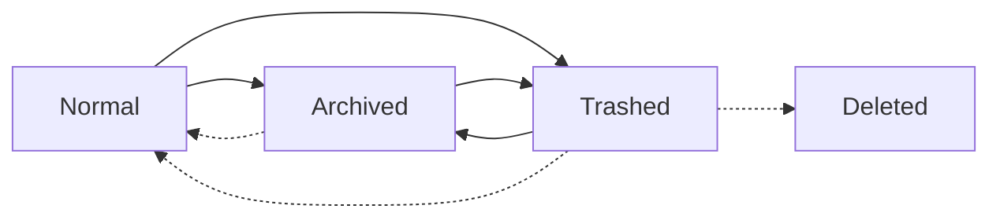

### Rename Project

Right click on a project to rename it. The project name should be unique in the server.

### Project Tag Management
To create a new tag, right click on the server and select `Create New Tag` in the context menu.

The project tags are displayed as folders in the project list.
The move a project in/out a tag, right click on the project and select `Move Project to Tag` / `Remove Project from Tag` in the context menu.
You can hover on an existing tag to rename or delete it. The projects under the deleted tag will be displayed outside automatically.

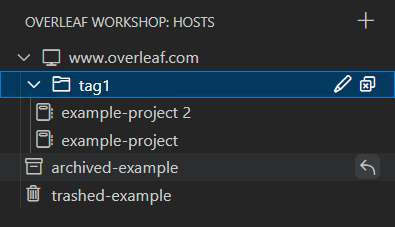

As the tags are treated as folders in philosophy, one project can only be in (added) one tag at a time.
If you want to add a project to multiple tags, please manage the tags on the web browser.

### Open Project

#### Open Project in Current/New Window

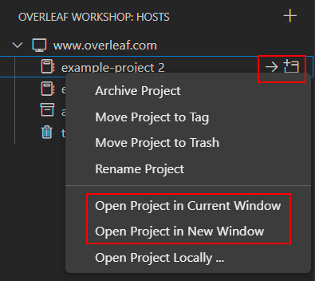

The Overleaf Workshop extension by default will open you project in a [virtual workspace](https://code.visualstudio.com/api/extension-guides/virtual-workspaces), just like the [WSL Extension](https://marketplace.visualstudio.com/items?itemName=ms-vscode-remote.remote-wsl).
You can choose to open the project in the current window or a new window. If you open the project in the current window, the current workspace will be replaced with the corresponding virtual workspace of the project.

However, due to the [limitation of the virtual workspace](https://github.com/microsoft/vscode/wiki/Virtual-Workspaces#signal-whether-your-extension-can-handle-virtual-workspaces), most of the existing VS Code extensions does not work in the virtual workspace. Meanwhile, the Overleaf Workshop extension is still under active development, and cannot compete with the matured [LaTeX Workshop Extension](https://github.com/James-Yu/LaTeX-Workshop) in terms of features and stability. In this case, you can choose to open the project locally.

#### Open Project Locally

> [!NOTE]
> The Overleaf features are not completely enabled in a local folder. Specifically, the [compile](#compile-project), [PDF preview](#preview-document), [intellisense](#intellisense) and [project history](#history-of-changes) features are disabled by default.
> 
> Currently, there is no way to enable these features in a local folder, especially considering people would like to use the LaTeX Workshop extension in a local folder. If you are in demand of these features, please consider to create a discussion in the [GitHub Discussions](https://github.com/iamhyc/Overleaf-Workshop/discussions)

The "Open Project Locally" feature is provided via a [local replica](#local-replica). The local replica is a folder on your local machine with a `.overleaf` folder presence, which is kept in sync with the project on the Overleaf server.

Please follow the steps below to setup a local replica and open the project locally:
1. Right click on the project and select `Open Project Locally...` in the context menu. A dialog will pop up to ask you to select a folder to create the local replica, if you have not created one before.

    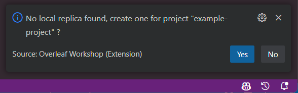

2. After confirm to create the local replica, a input box will pop up to ask you to choose the local parent folder to store the local replica. The auto-completion is supported with the start path as the root filesystem `/` (for Windows, it is actually `C:\`).

    When the parent folder path is chosen, please click the `Check` button on the right upper corner to submit the path. Please make sure the parent folder is writable and the local replica path will be created under the parent folder as `${parentFolder}/${projectName}`. If the local replica path already exists, it will be overwritten.

    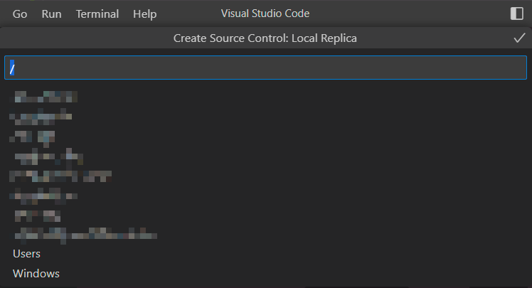

3. After the local replica is created, a input box will pop up to ask you to choose the local replica folder to open. Then you can open the project locally.

## Basic Usage

In this section, we assume you have opened a project in a default way (i.e., in a virtual workspace), cause [some features are not available in a local folder](#open-project-locally).

### Files Management

In the file explorer, you can create, rename, delete, and move files and folders as usual. For example, you can drag and drop a file from outside to the file explorer to upload it to the server.

All the operations will be synced to the Overleaf server in real time (unless you are in [invisible mode](#invisible-mode)), and any external changes from your collaborators will be synced to the file explorer as well.

#### `Pro` Import / Refresh External Linked Files

For the Overleaf Server Pro Edition server, you can [share files across project](https://www.overleaf.com/learn/how-to/Can_I_share_files_(e.g._.bib_and_some_graphics)_across_my_projects%3F) or [upload a file using an external URL](https://www.overleaf.com/learn/how-to/How_to_upload_a_file_using_an_external_URL).

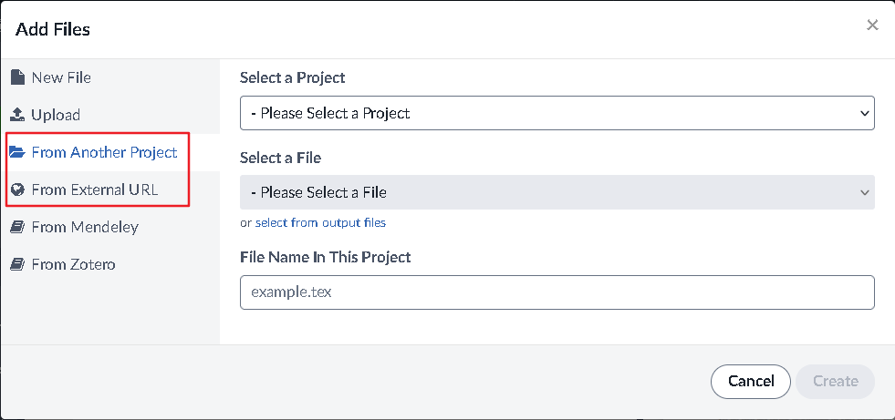

In the Overleaf Workshop extension, the linked files are displayed in the file explorer as a symbolic link, and you can right click on the linked file to refresh it via **"Overleaf: Refresh File"**.

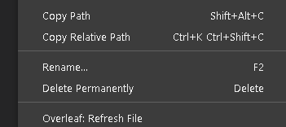

You can also right click on a folder to import a linked file via **"Overleaf: Import File ..."**, then it will prompt you to import a file from *another project* or *external URL*.

### Compile the Project

Different from the Overleaf web editor with an eye-catching `Recompile` button, the compile in Overleaf Workshop extension is triggered via shortcut <kbd>Ctrl</kbd>+<kbd>Alt</kbd>+<kbd>B</kbd>.

The compile status is displayed in the status bar, which is located at the bottom of the VS Code window.

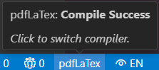

The default output folder is `.output` in the project root directory, which holds the compiled PDF `output.pdf` and other intermediate files. All the files in this folder are read-only, and you should not make any changes to them manually. You can change the name of the output folder in the [vscode settings](#configurations).

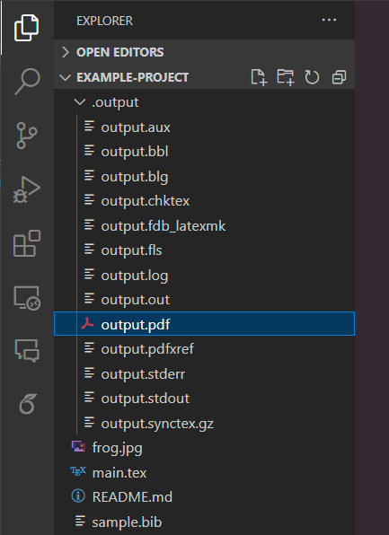

The compiled PDF `output.pdf` is also located in the output folder. You can double click the PDF file to open it, or use the shortcut <kbd>Ctrl</kbd>+<kbd>Alt</kbd>+<kbd>V</kbd> to open the compiled PDF directly on the right side of the editor.

#### Compiler Diagnostics

When the compile fails or succeeds with warnings, the compiler diagnostics will be displayed in the editor with colored squiggles. You can hover on the squiggles to see the detailed information.

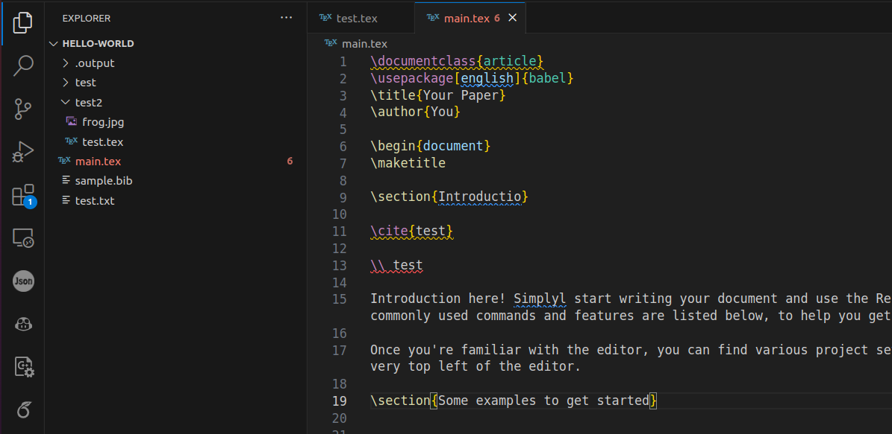

The full compiler diagnostics are displayed in the "Problems" panel, which is located at the bottom of the VS Code window.

#### Change the Compiler

The default compiler is `pdflatex`, which can be changed via clicking the compiler name in the status bar.

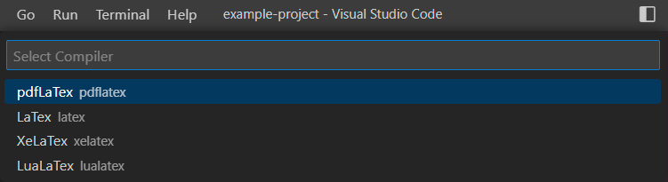

### Preview Document

The compiled PDF `output.pdf` is also located in the output folder. You can double click the PDF file to open it, or use the shortcut <kbd>Ctrl</kbd>+<kbd>Alt</kbd>+<kbd>V</kbd> to open the compiled PDF directly on the right side of the editor.

#### SyncTeX and Reverse SyncTeX

The SyncTeX and Reverse SyncTeX are supported in the Overleaf PDF viewer.

- **SyncTeX, Jump to PDF**: put your cursor in the expected position in the document editor, then press <kbd>Ctrl</kbd>+<kbd>Alt</kbd>+<kbd>J</kbd> to jump to the corresponding position in the PDF.
- **Reverse SyncTeX, Jump to Code**: double click on the text on PDF to jump to the corresponding position in the editor.N

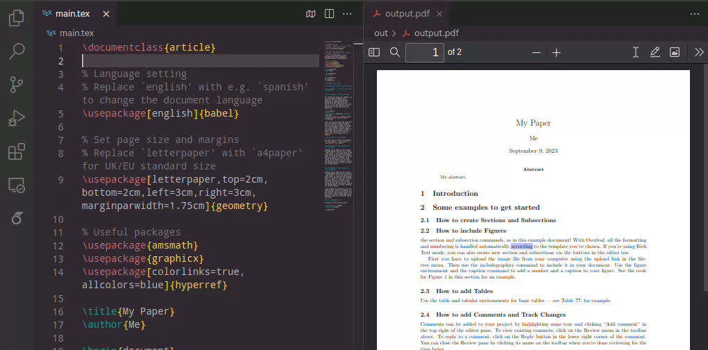

#### Change the Themes

There are three themes supported in the Overleaf PDF viewer: `default`, `light`, and `dark`. You can change the theme via clicking the theme button on the title bar in the Overleaf PDF viewer. You can also add or change the supported themes in the [vscode settings](#configurations).

P.S. If you cannot see the theme button, please make sure the PDF viewer is wide enough :)

### Intellisense

The intellisense feature is proposed to provide a seamless editing experience for LaTeX documents like in the Overleaf web editor and the LaTeX Workshop extension.

#### Document Outline

When you open a `.tex` file, the document outline will be displayed in the "Outline" panel.

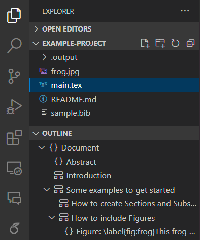

#### Auto Completion

#### Spell Check

The spell check feature is provided via the Overleaf server. The spell check is performed in the background, and the unknown words are underlined with a blue squiggle. You can use the shortcut <kbd>Ctrl</kbd>+<kbd>.</kbd> to view the suggestions, or directly add the word to the dictionary.

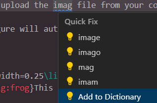

The spell check can be configured via clicking the spell check button on the title bar. You can turn off or change the language of the spell check. The learned words are also managed here.

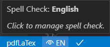

#### Document Prettify (Format)

You can use the shortcut <kbd>Shift</kbd>+<kbd>Alt</kbd>+<kbd>F</kbd> to prettify the document manually.

### Collaboration

#### Online Collaborators

When there are other collaborators (or your other login sessions) online, the colored cursors of the collaborators will be displayed in the document editor.

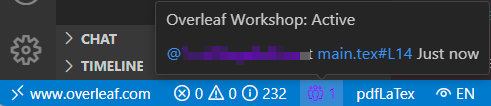

The online collaborators information is displayed on the status bar. The item icon shows the number of online collaborators, and the color represents the latest active collaborator.
You can hover on the item like below to see the detailed information of the online collaborators, and click the text like `@xxx` to cite the collaborator [in the chat view](#chat-with-collaborators), or click the text like `main.tex#L1` to jump to the exact position of the collaborator. 

#### Chat with Collaborators

The chat view is located at the primary sidebar of the VS Code window by default. You can type in the input box at the bottom of the chat view and press <kbd>Enter</kbd> to send the message.

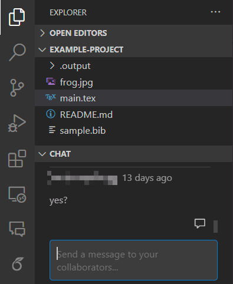

You can also click the "dialog"-like button to reply to a message. The detailed usage is elaborated in [Advance Chat Message](#advance-chat-message).

#### Project History View

The project history view is located at the primary sidebar of the VS Code window by default. You can view the history of changes of specific file when you open it in the editor. You can also click the "Clear Selection" button on the history view title bar to view the history of the whole project.

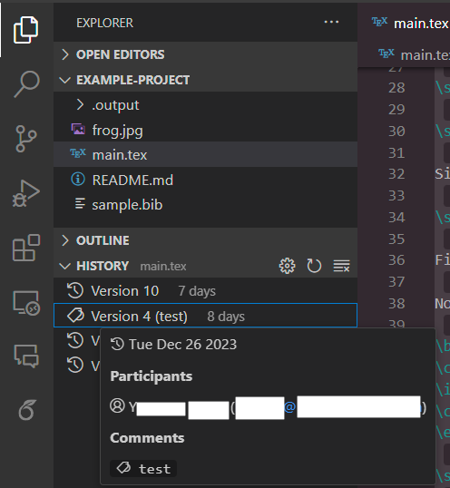

There are multiple functions provided in the history view:

- **Label Management**: Right click on a version item to add/remove a label.
- **Changes Compare**: Right click on a version item to compare with the previous version, current version, or a selected version.
- **Download Project**: Right click on a version item to download the project at that version.

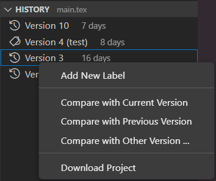

## Advanced Usage

### Advance Chat Message
> [!NOTE]
> This feature is not supported by Overleaf, and the format of the chat message is *ugly* on the Overleaf web editor.

To enhance the experience of collaboration via chat, we propose the following advanced features based on custom chat message format.

- **Line Reference**: You can select a block of text in the document editor, then right click on the selection and select `Copy Line Reference` or `Insert Line Reference` in the context menu to copy/insert a line reference to the chat input box. The line reference is in the format like `[[main.tex#L39C0-L43C12]]`

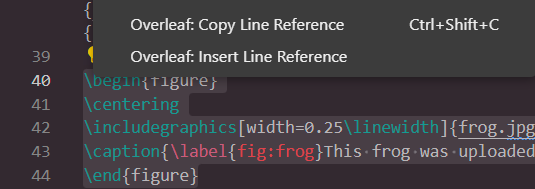

- **Reply Thread**: You can cite a message in the chat view by clicking the "dialog"-like button under each message, or click the user name to cite the user. The cite format would be like `@[[xxx#<user-id-length-24>]]`, where the user id is automatically completed when cite.

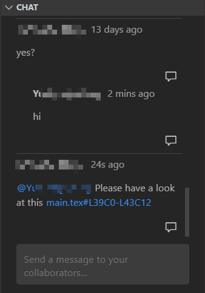

### Local Replica (Source Control)
> [!WARNING]
> This feature is not considered robust yet, and may not work as expected, especially under unstable network environment.
> Please use it with caution.

The Local Replica feature is a implementation of [Source Control Manager](anatomy.md#srcscm), which enables the possibility of "Open Project Locally".

The entrance is available on the status bar when you open the project locally. Or you can configure it via the "Configure Source Control" command in the command palette.

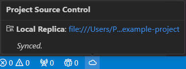

In the Local Replica configuration, you can choose to enable/disable the Local Replica temporarily, and configure the ignore patterns for the Local Replica.

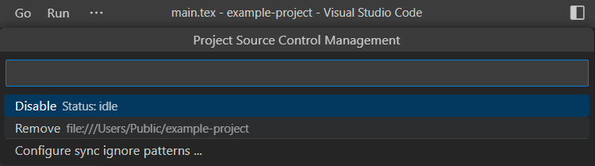

The project-related metadata for local replica are located in `.overleaf/settings.json` in the following format:
```json
{
    "uri": "overleaf-workshop://overleaf.com/example-project?user%3D<user_id>%26project%3D<project_id>",
    "serverName": "overleaf.com",
    "enableCompileNPreview": false,
    "projectName": "example-project",
}
```
Most of the items are immutable, except for `enableCompileNPreview`, which is used to enable/disable the compile and preview feature in local folder. The default value is `false`.

### Invisible Mode
> [!WARNING]
> This feature is not considered robust yet, and may not work as expected, especially under unstable network environment.
> Please use it with caution.

The Invisible Mode is a feature to disconnect the websocket connection to the server, and use the REST API to communicate with the server instead. This makes you fully invisible to other collaborators, unless you upload the local changes to the server.

You can enter/exist the invisible mode via clicking the collaborator icon on the status bar.
The chat messages and history of changes are refreshed periodically in the invisible mode. You can configure the refresh interval in the [vscode settings](#configurations). So when collaborators send you messages or make changes to the project, you can see the changes reflected in the chat view, history view, and file explorer.

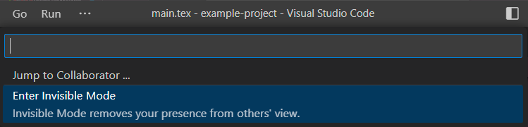

In invisible mode, after you make changes locally, you have to upload the changes manually to the server by clicking the upload button on the status bar, otherwise the changes will not be synced to the server.
The remote changes will be first fetched from the server, merged with the local changes, and then uploaded to the server.

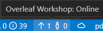

However, Invisible Mode is not a perfect solution for offline editing. You should be aware of the following limitations:
- You cannot see other collaborators' cursors;
- You cannot rename/delete files or folders created by other collaborators until you reload the project
  > or you can edit the file once to refresh the file metadata.
- Your local update is always force-upload and cause online collaborators out-of-sync;
  > while collaborators using this extension will not be affected.
- The remote update of "compiler or spell language settings" will not be updated locally;

### Commands and Shortcuts

The available commands and default shortcuts can be found in the command palette (press <kbd>F1</kbd> or <kbd>Ctrl</kbd>+<kbd>Shift</kbd>+<kbd>P</kbd>).

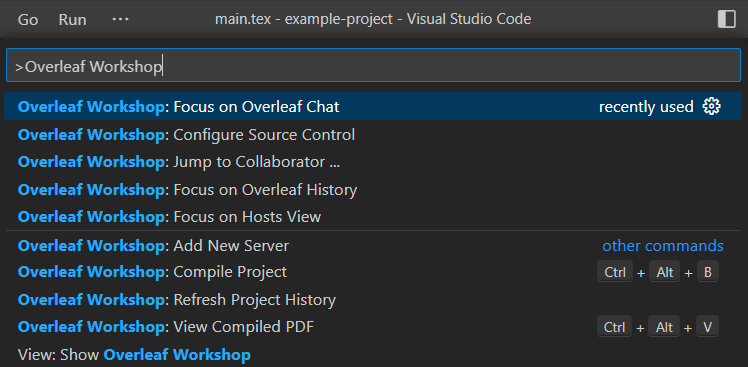

- **"Add New Server"**: This command is used to add a new server.
- **"Compile Project"**, **"View Compiled PDF"**: These commands are used to compile the project and view the compiled PDF, which use the same default shortcuts <kbd>Ctrl</kbd>+<kbd>Alt</kbd>+<kbd>B</kbd> and <kbd>Ctrl</kbd>+<kbd>Alt</kbd>+<kbd>V</kbd>, respectively, as the LaTeX Workshop extension.
- **"Configure Source Control"**: This command is used to configure the source control provider for the project.
- **Jump to PDF**: Press <kbd>Ctrl</kbd>+<kbd>Alt</kbd>+<kbd>J</kbd> with the cursor in the document editor to jump to the corresponding position in the PDF.
- **"Focus on Overleaf Chat"**, **"Focus on Overleaf History"**, **"Focus on Hosts View"**: These commands are used to focus on the corresponding views via keyboards without using mouse.
- "Jump to Collaborator": This command is used to move the cursor to the exact position of one of the collaborators.

Let us know if you have any suggestions for the commands and shortcuts in the [GitHub Discussions](https://github.com/iamhyc/Overleaf-Workshop/discussions).

### Configurations

The project-irrelevant configurations of the extension can be found in the VS Code settings (after `v0.8.0`). The configurations are only allowed to be changed in the user profile but not the workspace profile, in order to avoid accidentally uploading `.vscode` folder to the Overleaf server.

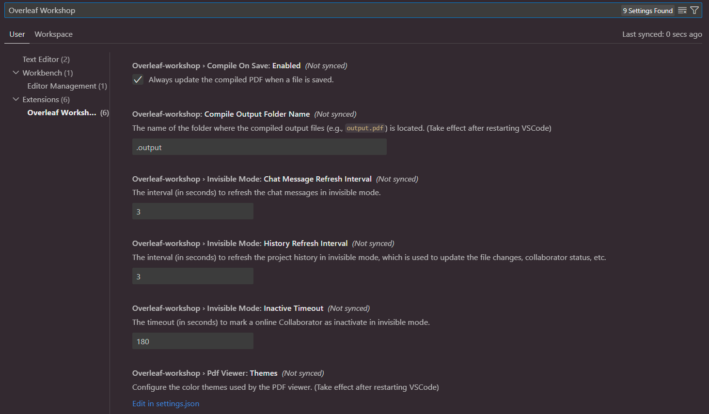

- **"Compile On Save"**: This configuration is used to enable/disable the compile on save feature. The default value is `true`.
- **Compile Output Folder Name**: This configuration is used to change the name of the output folder. The default value is `.output`. It takes effect after restarting VS Code.
- **Invisible Mode: Chat Message Refresh Interval**: This configuration is used to change the refresh interval of the chat messages in the invisible mode. The default value is `3` (3 seconds).
- **Invisible Mode: History Refresh Interval**: This configuration is used to change the refresh interval of the history of changes in the invisible mode. The default value is `3` (3 seconds).
- **Invisible Mode: Inactive Timeout**: This configuration is used to mark a online collaborator as inactive for a certain period of time. The default value is `180` (180 seconds).
- **PDF Viewer: Themes**: This configuration is used to change the supported sthemes of the PDF viewer. The default value is as follows:
    ```json
    "default": {
        "default": {"fontColor":"#000000", "bgColor":"#FFFFFF"},
        "light":   {"fontColor":"#000000", "bgColor":"#F5F5DC"},
        "dark":    {"fontColor":"#FBF0D9", "bgColor":"#4B4B4B"}
    }
    ```

## FAQ

#### Q1: How to compile and show the compiled PDF?

**A1**: Different from the Overleaf web editor with an eye-catching `Recompile` button, the compile in Overleaf Workshop extension is triggered via shortcut <kbd>Ctrl</kbd>+<kbd>Alt</kbd>+<kbd>B</kbd>.

The compiled PDF `output.pdf` is located in the output folder, which is `.output` by default. You can also use the shortcut <kbd>Ctrl</kbd>+<kbd>Alt</kbd>+<kbd>V</kbd> to open the compiled PDF directly.

P.S. The compile is also automatically triggered when you save a `.tex` file. This feature is enabled by default, and can be disabled in the vscode settings.


#### Q2: Why my VS Code plugin (e.g., `vscode-texlint`, `latex-utilities`) does not work?

**A2**: Due to the [limitation of the virtual workspace](https://github.com/microsoft/vscode/wiki/Virtual-Workspaces#signal-whether-your-extension-can-handle-virtual-workspaces), most of the existing VS Code extensions does not work in the virtual workspace. In this case, you can choose to [open the project locally](#open-project-locally) as a workaround.

Please notice that not all Overleaf features enabled in a local folder. More specifically, the [compile](#compile-project), [PDF preview](#preview-document), [intellisense](#intellisense) and [project history](#history-of-changes) features are disabled by default. You need to refer to [LaTeX Workshop Extension](https://github.com/James-Yu/LaTeX-Workshop) as a complement.


#### Q3: Why the extension loses connection to the server frequently or loading indefinitely?

**A3**: It depends on your network environment. If you are suffering from the frequent disconnection or indefinite loading, please try the following solutions:
- Ping the Overleaf server domain (e.g., `www.overleaf.com`) to see if the DNS is resolved correctly and the server is reachable.
- Remove the `Http: proxy` in the VS Code settings.
- Enable/Disable the network proxy for VS Code (or the Overleaf server domain) globally.
- Try [Invisible Mode](#invisible-mode), which does not use WebSocket to communicate with the server.

If the above solutions do not work, please consider to create a bug report in the [GitHub Issues](https://github.com/iamhyc/Overleaf-Workshop/issues/new/choose).
